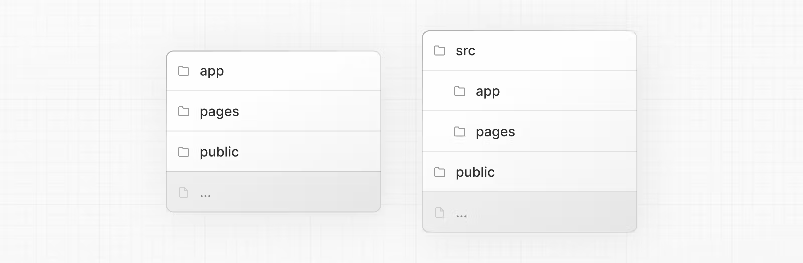

# Next.js Project Structure
- This page provides an overview of the project structure of a Next.js application.
It covers top-level files and folders, configuration files, and routing convertions within the `app` and `pages` directories.
> 이 페이지에서는 Next.js 응용 프로그램의 프로젝트 구조에 대한 개요를 제공합니다.
> `app` 및 `pages` 디렉토리 내의 최상위 파일 및 폴더, 구성 파일 및 라우팅 변환을 다룹니다.
- Click the file and folder names to learn more about each convention.
> 각 규칙에 대해 자세히 알아보려면 파일 및 폴더 이름을 클릭합니다.

## Top-level folders
- Top-level folders are used to organize your application's code and static assets.
> 최상위 폴더는 응용 프로그램의 코드와 정적 자산을 구성하는 데 사용됩니다.

    - `app` : App router
    - `pages` : Pages Router
    - `public` : Static assets to be served
    - `src` : Optional application source folder

## Top-level files
- Top-level files are used to configure your application, manage dependencies, run middleware, integrate monitoring tools, and define environment variables.
> 최상위 파일은 응용 프로그램 구성, 종속성 관리, 미들웨어 실행, 모니터링 도구 통합 및 환경 변수 정의에 사용됩니다.

    - `next.config.js` : Configuration file for Next.js
    - `package.json` : Project dependencies and scripts
    - `instrumentation.ts` : OpenTelemetry and Instrumentation file
    - `middleware.ts` : Next.js request middleware
    - `.env` : Environment variables
    - `.env.local` : Local environment variables
    - `.env.production` : Production environment variables
    - `.env.development` : Development environment variables
    - `.eslintrc.json` : Configuration file for ESLint
    - `.gitignore` : Git files and folders to ignore
    - `next-env.d.ts` : TypeScript declaration file for Next.js
    - `tsconfig.json` : Configuration file for TypeScript
    - `jsconfig.json` : Configration file for JavaScript

## `app` Routing Conventions
- The following file conventions are used to define routes and handle metadata in the `app` router.
> 다음 파일 규칙은 `app` 라우터에서 경로를 정의하고 메타데이터를 처리하는 데 사용됩니다.

### Routing Files
- `layout`  `.js` `.jsx` `.tsx` Layout
- `page`  `.js` `.jsx` `.tsx` Page
- `loading`  `.js` `.jsx` `.tsx` Loading UI
- `not-found`  `.js` `.jsx` `.tsx` Not found UI
- `error`  `.js` `.jsx` `.tsx` Error UI
- `global-error`  `.js` `.jsx` `.tsx` Global error UI
- `route`  `.js` `.ts` API endpoint
- `template`  `.js` `.jsx` `.tsx` Re-rendered layout
- `default`  `.js` `.jsx` `.tsx` Parallel route fallback page

### Nested Routes
- `folder` Route segment
- `folder/folder` Nexted route segment

### Dynamic Routes
- `[folder]` Dynamic route segment
- `[...folder]` Catch-all route segment
- `[[...folder]]` Optional catch-all route segment

### Route Groups and Private Folders
- `(folder)` Group routes without affecting routing
- `_folder` Ope folder and all child segments out of ruting

### Parallel and Intercepted Routes
- `@folder` Named solt
- `(.)folder` Intercept same level
- `(..)folder`  Intercept one level above
- `(..)(..)folder`  Intercept two level above
- `(...)folder` Intercept from root

### Metadata File Conventions
### App Icon
- `favicon` `.ico` Favicon file
- `icon` `.ico` `.jpg` `.jpeg` `.png` `.svg` Favicon file
- `icon` `.js` `.ts` `.tsx` Generated App Icon
- `apple-icon` `.jpg` `.jpeg` `.png` Apple App Icon file
- `apple-icon` `.js` `.ts` `.tsx` Generated Apple App Icon

### Open Graph and Twitter Images
- `opengraph-image` `.jpg` `.jpeg` `.png` `.gif` Open Graph image file
- `opengraph-image` `.js` `.ts` `.tsx` Generated Open Graph image
- `twitter-image` `.jpg` `.jpeg` `.png` `.gif` Twitter image file
- `twitter-image` `.js` `.ts` `.tsx` Generated Twitter image

### SEO
- `sitemap` `.xml` Sitemap file
- `sitemap` `.js` `.ts` Generated Sitemap
- `robots` `.txt` Robots file
- `robots` `.js` `.ts` Generated Robots file

## `pages` Routing Conventions
- The following file conventions are used to define routes in the `pages` router.
> 다음 파일 규칙은 `pages` 라우터에서 경로를 정의하는 데 사용됩니다.

