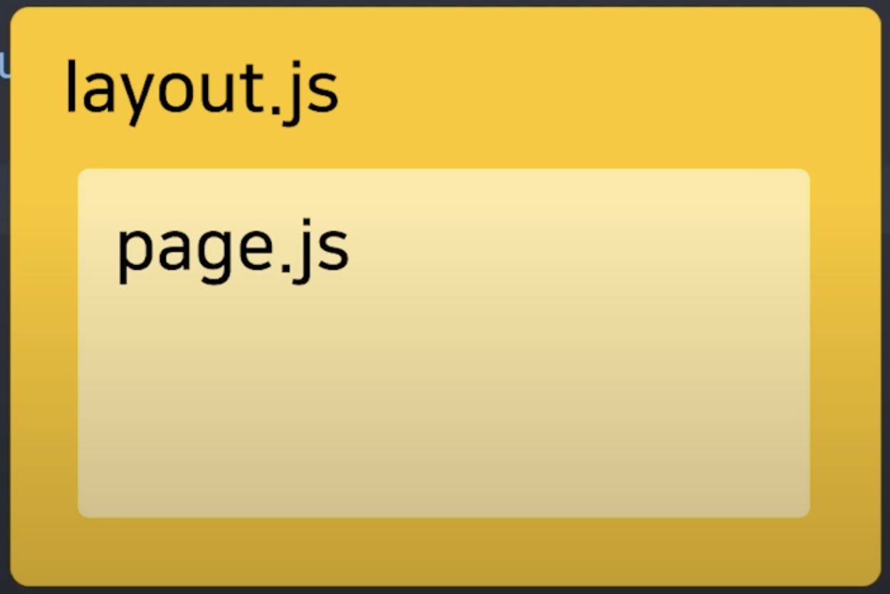
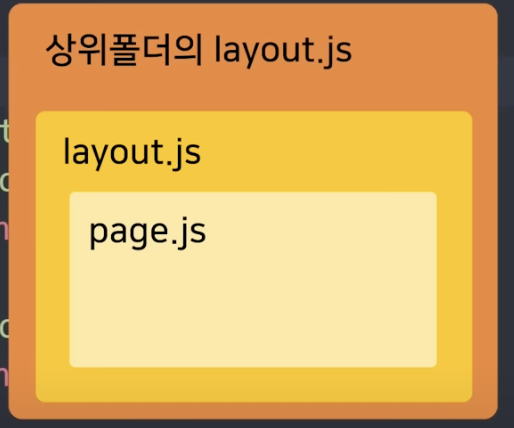
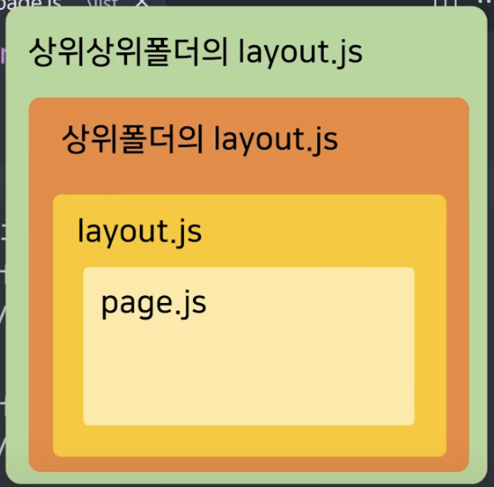

- `app/page.tsx`
    - 메인 페이지
- `app/layout.tsx`
    - page.tsx 바깥에 적을 내용이 있다면..
    - header, 공유 컴포넌트

- `xxx.module.css`
    - 특정 컴포넌트에서만 적용하는 css

- 해당 디렉터리에 `page.tsx`만 있는데 상관없나?
    - `layout.tsx`가 해당 디렉터리에 존재하는 경우 `layout.tsx`로 `page.tsx`를 감싸서 상위로 보냄

- 페이지 변경과 상관없이 계속 보여줄 컴포넌트의 경우엔 `layout.tsx`에 작성하는게 좋을 듯(`header`, `footer`)