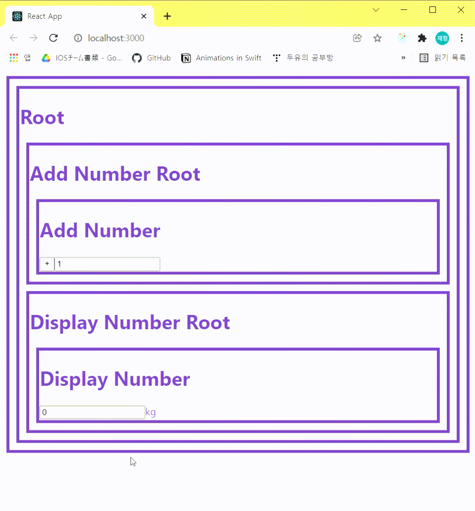

# React-with-Redux

  - reference: https://www.youtube.com/watch?v=fkNdsUVBksw&list=PLuHgQVnccGMDuVdsGtH1_452MtRxALb_7&index=1

# Result

# See Also
- React's Immutability
- React containers & components
- connect(mapStateToProps, mapDispatchToProps)
